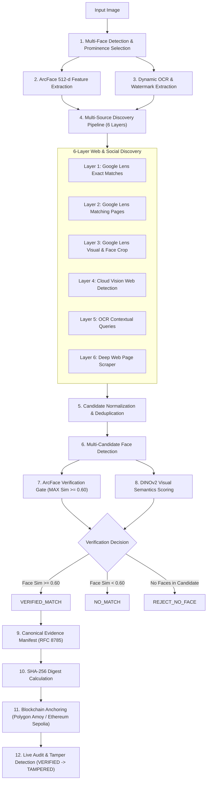

# TRACE-ID — Complete Pipeline Flow & Strategic Roadmap
**Tagline:** *Discover. Verify. Anchor.*  
**Domain:** Decentralized Digital Forensics, Biometric Verification & Tamper-Evident Evidence Anchoring

---

## 1. High-Level Architecture Flow



---

## 2. End-to-End Operational Pipeline (11-Step Flow)

```
========================================================================================
[1] INPUT
    • Image Path: data/input/target.jpg
    • Resolution & format validation
    • Color-space normalization (BGR/RGB)

[2] FACE DETECTION & PROMINENCE SELECTION
    • InsightFace (RetinaFace / buffalo_l) detects ALL faces in scene
    • Prominence Score = (Area * 0.50) + (Centrality * 0.30) + (Confidence * 0.20)
    • Primary Face Selected (or manual override via --face-index <N>)

[3] FACE EMBEDDING EXTRACTION
    • 512-dimensional L2-normalized deep metric vector extracted
    • Norm invariant: ||e_input|| = 1.0000

[4] DYNAMIC OCR & WATERMARK EXTRACTION
    • EasyOCR + Cloud Vision text annotation
    • Extracts visible text overlays, creator watermarks, channel handles
    • Zero hardcoded usernames or search queries

[5] MULTI-SOURCE REVERSE SEARCH (6 LAYERS)
    • Layer 1: Google Lens Exact Matches
    • Layer 2: Google Lens Matching Pages (Articles, Profiles, Reels)
    • Layer 3: Google Lens Visual Approximations + Isolated Face Crop
    • Layer 4: Google Cloud Vision Web Detection (Full, Partial, Pages)
    • Layer 5: Dynamic OCR Context Discovery (SerpApi Google Search)
    • Layer 6: Web Page Deep Scraper (BeautifulSoup4 / og:image / video thumbnails)

[6] CANDIDATE COLLECTION & DEDUPLICATION
    • Normalizes URLs (strips UTM tags, session queries, protocol casing)
    • Deduplicates by canonical page URL, image URL, and content SHA-256
    • Prioritizes authentic social domains (Instagram, X, YouTube, LinkedIn, Facebook)

[7] BIOMETRIC & VISUAL VERIFICATION
    • Downloads candidate image to data/candidates/<sha256>.ext
    • Detects ALL faces in candidate image
    • Candidate Face Sim = MAX(Cosine_Similarity(e_input, e_candidate_i))
    • DINOv2 Visual Similarity computed as supporting score
    • Mandatory Biometric Gate: sim >= 0.60 -> PASS (DINOv2 never overrides face pass)

[8] VERIFIED MATCH RANKING
    • Selects top verified candidate by combined score
    • Preserves authentic social platform origins and public URLs

[9] CANONICAL EVIDENCE MANIFEST
    • Constructs deterministic JSON manifest (sorted keys, compact separators)
    • Computes 64-character SHA-256 evidence hash
    • Zero raw biometrics stored in manifest or on-chain

[10] BLOCKCHAIN ANCHORING
    • Polygon Amoy / Ethereum Sepolia smart contract (EvidenceRegistry.sol)
    • anchorEvidence(recordId, evidenceHash)
    • Emits EvidenceAnchored event with block number & timestamp

[11] LIVE BLOCKCHAIN AUDIT & TAMPER DETECTION
    • Re-canonicalizes manifest and recalculates SHA-256
    • Queries on-chain getEvidence(recordId)
    • Status: VERIFIED (hashes match) -> TAMPERED (any byte modified)
========================================================================================
```

---

## 3. Candidate Discovery & Scoring Matrix

| Result Metric | Mandatory Gate? | Weight | Purpose |
| :--- | :---: | :---: | :--- |
| **ArcFace Cosine Similarity** | **YES (Mandatory)** | **0.60** | Determines biometric correspondence across different poses, lighting, angles, and clothing ($\ge 0.60$). |
| **DINOv2 Visual Similarity** | NO (Supporting) | **0.30** | Measures background composition and holistic visual context. |
| **Discovery Source Confidence** | NO (Supporting) | **0.10** | Reflects multi-engine search agreement. |

$$\text{Final Score} = (0.60 \times \text{Face Sim}) + (0.30 \times \text{Visual Sim}) + (0.10 \times \text{Discovery Conf})$$

---

## 4. Blockchain Evidence Audit & Tamper Flow

```
+-------------------------------------------------------------------------+
|                        AUTHENTIC MANIFEST AUDIT                         |
+-------------------------------------------------------------------------+
  data/evidence/manifest.json
       |
       v
  RFC 8785 Canonical JSON Serialization
       |
       v
  Local SHA-256 Digest:  795ad4b104ccb851c11898e0e3c1e43b...
       |
       +=============================+
       |   EVM Smart Contract Query   |
       |  0x4978328Ff7665676e...     |
       +=============================+
       |
       v
  On-Chain Digest:       795ad4b104ccb851c11898e0e3c1e43b...
       |
       v
  [STATUS: VERIFIED — EVIDENCE UNCHANGED AND ANCHORED ON-CHAIN]


+-------------------------------------------------------------------------+
|                        TAMPERED MANIFEST AUDIT                          |
+-------------------------------------------------------------------------+
  data/evidence/manifest.json (Altered: face_similarity 0.7308 -> 0.9999)
       |
       v
  RFC 8785 Canonical JSON Serialization
       |
       v
  Local SHA-256 Digest:  b341cfd14e9e048c2ec85718dfb5a26c...
       |
       +=============================+
       |   EVM Smart Contract Query   |
       |  0x4978328Ff7665676e...     |
       +=============================+
       |
       v
  On-Chain Digest:       795ad4b104ccb851c11898e0e3c1e43b...
       |
       v
  [STATUS: TAMPERED — EVIDENCE HASH DOES NOT MATCH ON-CHAIN RECORD!]
```

---

## 5. Strategic Development Roadmap

```
┌─────────────────────────────────────────────────────────────────────────────────────────┐
│                                   TRACE-ID ROADMAP MATRIX                               │
├───────────────────┬───────────────────┬───────────────────┬─────────────────────────────┤
│      PHASE 1      │      PHASE 2      │      PHASE 3      │           PHASE 4           │
│   FOUNDATION &    │  SCALE, DEEP WEB  │  ZERO-KNOWLEDGE   │     DEEPFAKE FORENSICS &    │
│  HACKER HOUSE MVP │ & VECTOR INDEXING │  PRIVACY & DEPIN  │     ENTERPRISE COMPLIANCE   │
│    [COMPLETED]    │   [1 - 3 MONTHS]  │   [3 - 6 MONTHS]  │        [6 - 12 MONTHS]      │
└───────────────────┴───────────────────┴───────────────────┴─────────────────────────────┘
```

### Phase 1: Foundation & Core Verification Engine *(Completed)*
- [x] Multi-face prominence detector (area, centrality, quality).
- [x] InsightFace / ArcFace 512-d feature extraction with calibrated thresholding ($\ge 0.60$).
- [x] 6-Layer Multi-Source Discovery (Google Lens, Reverse Image, Cloud Vision, EasyOCR, Page Scraper).
- [x] DINOv2 ViT-S/14 secondary visual semantics.
- [x] Deterministic RFC 8785 JSON canonicalization and SHA-256 hashing.
- [x] EVM Smart Contract (`EvidenceRegistry.sol`) on Polygon Amoy & Ethereum Sepolia.
- [x] Live on-chain audit and tamper demonstration (`VERIFIED -> TAMPERED`).
- [x] Full test suite with 93/93 passing unit & integration tests.
- [x] Glassmorphic interactive Web UI and CLI runner.

### Phase 2: Scale, Deep Web Discovery & Vector Indexing *(1 – 3 Months)*
- [ ] **Headless Social Scrapers (Playwright / Camoufox):** Dynamic JavaScript SPA scrapers for Instagram Stories/Carousels, X/Twitter media tabs, Threads, Bluesky, TikTok video covers.
- [ ] **Async Task Queue (Celery + Redis):** Decouple discovery, image downloads, and model inference into distributed parallel workers.
- [ ] **Vector Database (Qdrant / Milvus / pgvector):** Index millions of candidate face embeddings for sub-millisecond $O(1)$ reverse face queries.
- [ ] **Adaptive Biometrics (MagFace / AdaFace):** Handle extreme head poses, lighting variations, and partial face occlusions.

### Phase 3: Zero-Knowledge Privacy & Decentralized Storage *(3 – 6 Months)*
- [ ] **zk-SNARK Biometric Proofs (Circom / Noir):** Prove face similarity above threshold $T$ without revealing face embeddings or raw photos to the blockchain.
- [ ] **Permanent Decentralized Storage (Arweave / IPFS / Filecoin):** Store encrypted evidence manifests with content-addressable immutable CIDs.
- [ ] **Account Abstraction (ERC-4337):** Gasless meta-transactions via Biconomy / Paymaster.
- [ ] **W3C Verifiable Credentials (VC) & DIDs:** Interoperability with digital identity wallets (Polygon ID, Privado ID).

### Phase 4: Deepfake Forensics, Content Provenance & C2PA *(6 – 12 Months)*
- [ ] **Deepfake Classifier (DIRE / CNN-Spot):** Distinguish genuine photographs from synthetic AI generations and face-swaps.
- [ ] **C2PA Standard Provenance:** Inject signed C2PA provenance manifests into verified image headers.
- [ ] **Cross-Chain State Proofs (Chainlink CCIP / LayerZero):** Multi-chain evidence anchoring across Polygon, Arbitrum, Base, and Ethereum.
- [ ] **Sentinel Monitoring Mode:** Continuous background surveillance alerting users when new unauthorized photos appear online.

### Phase 5: Legal Admissibility, Enterprise SDK & Governance *(12+ Months)*
- [ ] **Official SDKs:** `traceid-python`, `traceid-js`, `traceid-go` with webhook event dispatching.
- [ ] **Court-Admissible Evidence Reports:** PDF/A forensic reports compliant with US FRE 902(13)/(14) and Indian BSA / Section 65B.
- [ ] **Biometric Consent Vaults:** Self-sovereign identity revocation and GDPR Article 17 compliance.

---

## 6. Technology Stack Reference

| Subsystem | Technology / Library |
| :--- | :--- |
| **Face Biometrics** | InsightFace `buffalo_l` (`w600k_r50` ArcFace), OpenCV, NumPy |
| **Visual Verification** | PyTorch, DINOv2 `dinov2_vits14`, Torchvision |
| **OCR & Text Signals** | EasyOCR, Google Cloud Vision Text Detection |
| **Discovery Engines** | SerpApi (Google Lens, Reverse Image), Cloud Vision Web Detection, BeautifulSoup4 |
| **Evidence & Cryptography** | SHA-256 (`hashlib`), RFC 8785 JSON Canonicalization |
| **Blockchain** | Solidity 0.8.20+, Web3.py, py-solc-x, Polygon Amoy, Ethereum Sepolia |
| **Backend & Web UI** | FastAPI, Uvicorn, Vanilla CSS Glassmorphism |
| **Testing & CI** | Pytest, Pytest-Mock, GitHub Actions |

---

## 7. Execution Commands Quick Reference

```powershell
# 1. Run full end-to-end discovery, verification, and blockchain anchoring:
python -m app.main --input data/input/sundar_pichai.png

# 2. Select specific face in multi-person image:
python -m app.main --input data/input/group_photo.jpg --face-index 1

# 3. Run live blockchain audit:
python -m app.main --audit data/evidence/manifest.json

# 4. Run live tamper detection demonstration:
python -m app.main --tamper-demo data/evidence/manifest.json

# 5. Start interactive Web UI:
python -m uvicorn app.web.server:app --host 127.0.0.1 --port 8000

# 6. Run automated test suite (93 tests):
pytest tests/ -v
```
